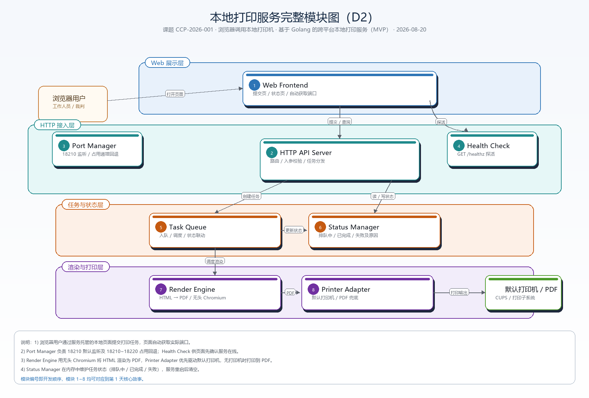

# 课程项目第 2 天报告

## 基本信息

- 课题编号：CCP-2026-001
- 课题名称：浏览器调用本地打印机——基于 Golang 的跨平台本地打印服务（MVP）
- 开发方式：独立完成
- 成员 / 立项人：侯俊
- 报告日期：2026-08-20（第 2 天）
- 工期安排：共 9 天，2026-08-19 至 2026-08-27

## 今日目标

第 1 天已确定 9 天最小功能范围、验收口径与风险。今天把范围翻译成可实现的组成部分，并为关键技术点完成选型，作为后续编码的直接依据。具体三件事：

1. 画出本地打印服务的完整模块图，明确外部使用者、内部模块及模块间依赖方向；
2. 输出模块职责说明，并把第 1 天核心故事逐条对应到负责模块，确认没有需求无人承担；
3. 对 HTML/PDF 渲染、端口协商两个关键选型做方案比选，写明入选理由与放弃理由。

## 组成部分

### 完整模块图

### 模块职责说明

- **Web Frontend**：负责托管提交页与状态页，页面通过 `location.port` 自动获取实际端口。
  - 输入：用户在浏览器中的填写内容。
  - 输出：提交给 API 的 JSON、页面展示的任务状态。
  - 上下游：上游为浏览器用户；下游为 HTTP API Server、Health Check。

- **Port Manager**：负责端口协商，默认监听 18210，若被占用则递增回退到 18210~18220 内可用端口。
  - 输入：默认端口 18210 与端口占用探测结果。
  - 输出：实际监听端口，写入日志与 `port.txt`。
  - 上下游：被 HTTP API Server 调用，无外部依赖。

- **Health Check**：提供探活接口，供页面确认服务是否在线。
  - 输入：`GET /healthz` 请求。
  - 输出：在线 / 离线状态响应。
  - 上下游：被 Web Frontend 调用。

- **HTTP API Server**：负责路由与入参校验，把请求分发给下游模块。
  - 输入：`/submit`、`/status`、`/healthz` 请求。
  - 输出：任务 ID、状态 JSON、错误信息。
  - 上下游：上游为 Web Frontend；下游为 Task Queue、Status Manager。

- **Task Queue**：负责任务入队与调度。
  - 输入：校验后的任务参数。
  - 输出：排队中的任务。
  - 上下游：上游为 HTTP API Server；下游为 Render Engine；更新状态给 Status Manager。

- **Render Engine**：负责把 HTML 渲染为 PDF。
  - 输入：任务数据（队名 / 题号 / 通过时间 或 源码）。
  - 输出：PDF 文件路径。
  - 上下游：上游为 Task Queue；下游为 Printer Adapter。

- **Printer Adapter**：负责驱动默认打印机输出，无实体打印机时打印到 PDF 兜底。
  - 输入：PDF 文件路径。
  - 输出：默认打印机出纸 或 PDF 产物。
  - 上下游：上游为 Render Engine；下游为操作系统打印子系统 / CUPS。

- **Status Manager**：负责在内存中维护任务状态机。
  - 输入：状态变更事件与查询请求。
  - 输出：排队中 / 已完成 / 失败及原因。
  - 上下游：被 HTTP API Server 读写，接收 Task Queue 的状态更新。

### 模块协作主路径

1. 浏览器用户打开服务托管的本地页面（Web Frontend）。
2. 页面先请求 `GET /healthz` 探活（Health Check），确认服务在线。
3. 用户选择气球小票或代码打印并填写内容，页面把 JSON 提交到 `/submit`（HTTP API Server）。
4. HTTP API Server 校验入参后写入 Task Queue，并返回任务 ID；Status Manager 记录状态为排队中。
5. Task Queue 调度任务给 Render Engine，Render Engine 用无头 Chromium 把 HTML 渲染成 PDF。
6. Render Engine 把 PDF 交给 Printer Adapter，Printer Adapter 驱动默认打印机输出；无实体打印机时打印到 PDF。
7. Status Manager 把任务状态更新为已完成或失败及原因。
8. Web Frontend 通过 `/status` 轮询，把最新状态展示给用户。

## 与需求的对应

第 1 天的 3 条核心必做与负责组成部分的对应关系：

- **核心故事一：用户在浏览器打开本地页面，通过 HTTP 提交打印任务**
  - 负责模块：Web Frontend、HTTP API Server、Port Manager
  - 第 5 天演示：是
  - 演示内容：页面打开、端口自动获取、提交后返回任务 ID

- **核心故事二：本地服务渲染排版并送到默认打印机输出**
  - 负责模块：Render Engine、Printer Adapter
  - 第 5 天演示：是
  - 演示内容：气球小票、代码打印的 PDF 或出纸

- **核心故事三：页面可随时查询任务状态（排队中 / 已完成 / 失败）**
  - 负责模块：Status Manager、HTTP API Server、Web Frontend
  - 第 5 天演示：是
  - 演示内容：状态从排队中变为已完成

处理办法：三条核心故事均有明确负责的模块组合，不存在无人承担的需求。Health Check 虽不是独立故事，但属于"打开页面后先确认服务在线"主路径的必要步骤，因此保留；模块图上也没有对不上需求的空模块。

## 技术选型

选型原则：看个人熟悉度；受题目语言限定（Golang）；看 9 天内能否调试与演示；不因"最新"而选型。

### 选型 1：HTML/PDF 渲染方案

候选方案：

- **方案 A：无头 Chromium**
  - 熟悉度：中，Day 1 已在 Windows 用 `chrome --headless --print-to-pdf` 跑出最小产物。
  - 安装便利：Windows 已可用；Linux 需安装 chromium + fonts-noto-cjk。
  - 与需求接近度：高，可用 CSS 精确复刻 58mm/80mm 小票和代码排版。
  - 中文 / 窄纸支持：好，CSS 指定字体与纸张宽度。
  - 问题定位：高，命令行可直接复现。

- **方案 B：wkhtmltopdf**
  - 熟悉度：低，本机未安装验证。
  - 安装便利：需分别确认 Windows/Linux 二进制版本。
  - 与需求接近度：中，对现代 CSS 支持较弱。
  - 中文 / 窄纸支持：一般，字体配置容易出错。
  - 问题定位：中，排版问题一天内难定位。

- **方案 C：gofpdf**
  - 熟悉度：中，写过简单 PDF，但无 HTML/CSS 排版能力。
  - 安装便利：仅依赖 Go 包，最简单。
  - 与需求接近度：低，需手写坐标排版。
  - 中文 / 窄纸支持：差，需手动计算折行，窄纸易截断。
  - 问题定位：高，纯 Go 代码可单步调试。

**入选：方案 A（无头 Chromium）**

入选理由：与题目"可用无头 Chromium 或等价方案渲染 HTML/PDF"直接对齐；Day 1 已在 Windows 实测验证，主路径可行；HTML/CSS 排版最能满足窄纸宽、语法高亮、中文注释等需求。

放弃理由：
- 放弃方案 B：wkhtmltopdf 已停止维护，现代 CSS 支持不足，小票和中文问题一天内难定位。
- 放弃方案 C：gofpdf 没有 HTML/CSS 渲染能力，语法高亮、窄纸折行需从零手写，开发量超出 9 天 MVP 范围。

### 选型 2：端口协商方案

候选方案：

- **方案 A：固定默认端口 + 递增回退**
  - 熟悉度 / 复杂度：高 / 低，纯 Go 实现。
  - 与题目示例接近度：高，对应"固定配置 + 页面探活"。
  - 问题定位：高，日志与 `port.txt` 可直接核对。

- **方案 B：启动时写注册文件，页面读取文件**
  - 熟悉度 / 复杂度：中 / 中。
  - 与题目示例接近度：中。
  - 问题定位：中，需检查文件路径、权限、并发读写。

- **方案 C：mDNS / Bonjour 服务发现**
  - 熟悉度 / 复杂度：低 / 高。
  - 与题目示例接近度：低，超出题目范围。
  - 问题定位：低，受防火墙和网络环境影响大。

**入选：方案 A（固定默认端口 + 递增回退）**

入选理由：与第 1 天报告"默认监听 127.0.0.1:18210，端口被占用时自动回退"完全一致；实现简单，一天内可验证；页面用 `location.port` 即可获取实际端口，无需额外机制。

放弃理由：
- 放弃方案 B：页面需解析注册文件，引入路径、权限、并发读写等新失败点，与"最小可用"原则冲突。
- 放弃方案 C：对单人 9 天项目过度设计，受防火墙影响大，演示环境难排查。

## 今日完成与自检

### 今天已确定的结论

1. 完成本地打印服务完整模块图，含外部使用者、8 个内部模块、依赖方向、层说明与底部注释。
2. 输出每个模块的职责、输入、输出与上下游关系。
3. 第 1 天 3 条核心故事均对应到负责模块，第 5 天均可演示；无空模块、无无人承担的需求。
4. 渲染选型定为无头 Chromium，端口选型定为固定默认端口 + 递增回退，两个选型均给出放弃理由。
5. 自检：核心需求均有负责部分（通过）；能说明为何不选另一方案（通过）。

### 尚未确定的选型与边界

- **Linux 演示环境**：三选一未定案（WSL2 / 借用 Linux 机器 / 虚拟机）。处理计划：D3 前确定；备选降级为交叉编译 + 远程环境截图。
- **语法高亮库**：计划用 chroma，依赖拉取未验证。处理计划：D3 实际拉取验证；若离线则准备本地 fallback。
- **HTTP API 字段**：尚未冻结。处理计划：D3 冻结 `/submit`、`/status` 请求响应 JSON 字段，作为后续模块开发契约。
- **端口全部被占用**：边界未定。处理计划：D3 定案（扩大回退区间或报错退出）。

## 问题、计划与 AI 沟通

### 不成功的沟通

1. 首次让 AI 生成模块图时只给了"完整模块图"一个模糊要求，回复初稿模块过多、出现对不上需求的部分。收窄为"主路径模块 → 职责 → 依赖"分步提问后，再用第 1 天故事逐条裁剪，才得到可用版本。
2. 生成 docx 前未先验证模板文件，直接引用损坏的 `模版.docx` 导致报错。之后生成前先用工具检查文件完整性。

### 比较有效的沟通

1. 提问时写清"约束：单人、9 天、Golang；需求：模块图与选型表；范围：只写架构说明；输出：模块职责说明 + 需求对应 + 选型比选"，得到结构清晰的产出。
2. 要求 AI 先通读 Day 1 报告、题目要求与参考图片再生成，避免与已定路线冲突。

### 明日安排（D3）

1. **Go 服务骨架**：按模块图初始化 `cmd/printsvc/` 与 `internal/{server,render,printer,task,port}/`，实现 `GET /healthz`，产出 Windows 可执行文件与 Linux 交叉编译产物。
2. **端口协商最小闭环**：实现 18210 监听与占用回退，写入日志与 `port.txt`；用另一进程占住 18210 验证回退行为。
3. **渲染子模块 v0**：把 Day 1 验证的无头渲染命令封装为 Go 函数，生成小票 PDF 样张并目检中文；输出 Linux 依赖清单（chromium、fonts-noto-cjk、cups）。
4. **HTTP API 字段冻结**：确定 `/submit`、`/status` 的请求 / 响应 JSON 字段，写入代码注释与报告。

---

**附件：**
- `module_diagram_d2.png`：本地打印服务完整模块图
